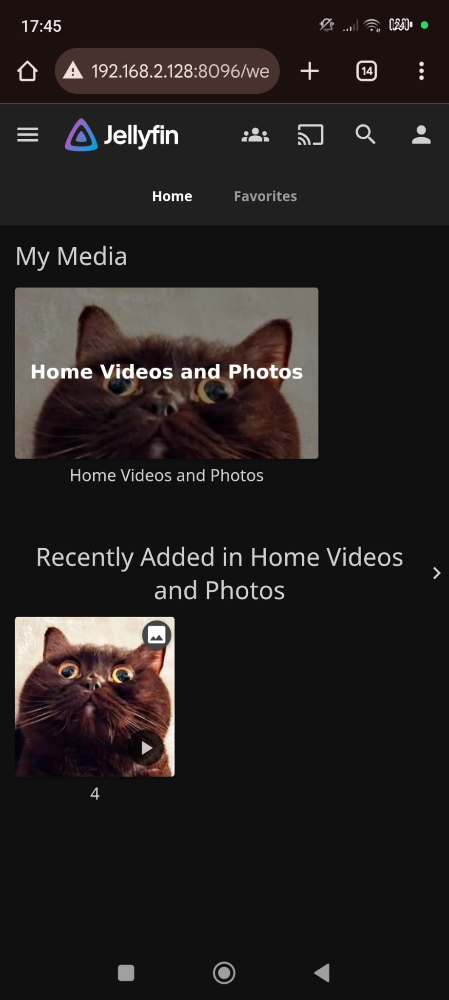

## Media-Server - Experience over Functionality

### A Linux home server with pictures/videos from holidays. A source of experience, and maybe some functionality.

I’m using my old PC for this server. It is still in use as a Windows 10 machine, but the goal is to convert it into a Linux server.

To achieve this, I installed VMware Workstation and created a Proxmox server running as a VM. I can access it through the web browser using this address: http://192.168.2.127:8006/.

**Proxmox Information**:  
Proxmox is a virtualization platform that allows you to manage virtual machines and containers in one place. It supports both KVM for full virtualization and LXC for container-based virtualization.

Furthermore, inside the Proxmox Server VM, I installed OpenMediaVault (OMV) as a VM, aka nested virtualization. I now have two options for managing OMV: either using the OMV console from the Proxmox web interface, or more conveniently, SSH via Putty to the IP `192.168.2.128`.

**OpenMediaVault Information**:  
OpenMediaVault is a free network-attached storage (NAS) solution based on Debian Linux. It offers a user-friendly web interface and supports file sharing protocols, Docker containers, and more.

Straying further from simplicity, I installed Docker and Portainer as a container. This allows me to easily manage other containers, including Jellyfin, which will present my intended content of pictures/videos from holidays.

**Docker and Portainer Information**:  
Docker is a containerization platform that allows you to run applications in isolated environments. Portainer is a web UI for managing Docker containers, making it much easier to set up and manage your applications.

**Jellyfin Information**:  
Jellyfin is a free and open-source media server software for managing and streaming your media files, like movies, TV shows, and personal videos.

Once Portainer was running, I was able to access it in a web browser using this address: http://192.168.2.128:9000/.

There, I created a new container for Jellyfin with all the necessary settings for ports, volumes, and restart policy. After the Jellyfin container was successfully deployed, I used FileZilla to transfer the content over to the OMV. For this, I used:

- **Host**: `sftp://192.168.2.128`
- **Username**: `root`
- **Port**: blank

Finally, I transferred the pictures/videos over to **/var/lib/docker/volumes/portainer_data/_data** and viewed them on the server at http://192.168.2.128:8096/.

